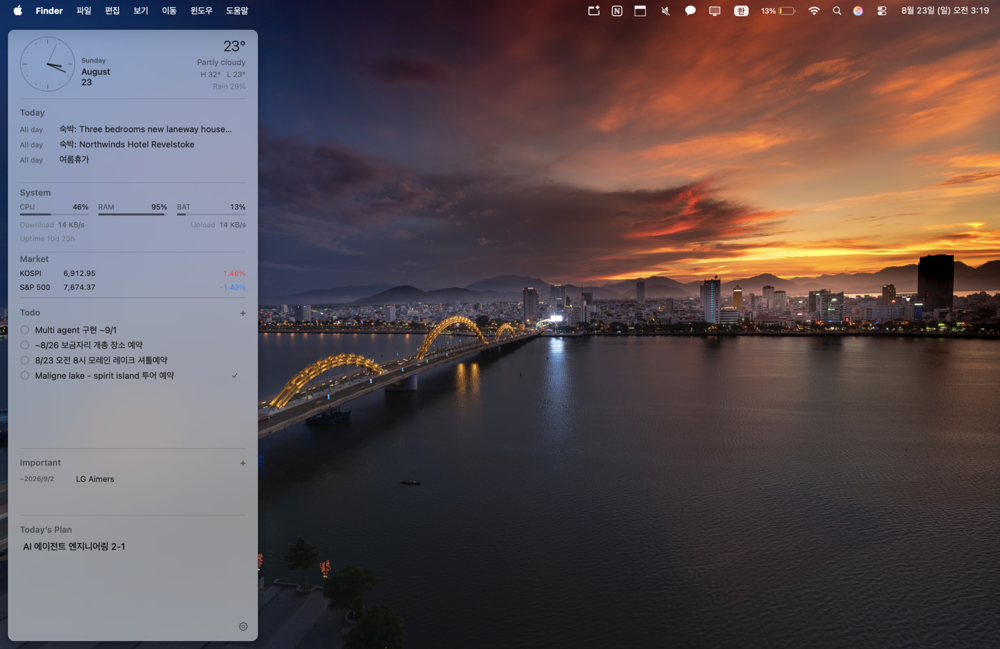

# DeskBoard

DeskBoard is a native macOS productivity sidebar that keeps the information you use throughout the day visible on the desktop. It combines time and weather, today's calendar, system status, market quotes, todos, important dates, and a free-form memo in one lightweight panel.



## Features

- Native SwiftUI and AppKit interface with a translucent, floating desktop panel
- Left- or right-side placement on the selected display
- Desktop and Always on Top window modes
- Digital and analog clock styles
- Menu-bar-style Quick Open buttons for Notion, ChatGPT, KakaoTalk, Chrome, and Finder
- Current weather, daily high/low, and precipitation probability
- Today's events and locations from selected macOS calendars
- CPU, memory, battery, network throughput, and uptime monitoring
- KOSPI, KOSDAQ, S&P 500, NASDAQ Composite, USD/KRW, and EUR/KRW quotes
- Editable todos, important items with optional dates, and an autosaving memo
- Adaptive section sizing with independent scrolling for longer lists
- Light, dark, and system appearances with adjustable background opacity
- Optional Dock and menu bar icons with launch-at-login support

Todos, important items, and the memo are stored locally with SwiftData. The app has no external package dependencies.

## Requirements

- macOS 14.0 or later
- Xcode 15 or later

## Build and Run

1. Clone the repository.
2. Open `DeskBoard.xcodeproj` in Xcode.
3. Select the `DeskBoard` scheme and the `My Mac` destination.
4. If Xcode requests it, select your own development team under **Signing & Capabilities**.
5. Press **Command-R**.

You can also build from Terminal:

```sh
DEVELOPER_DIR=/Applications/Xcode.app/Contents/Developer \
  xcodebuild \
  -project DeskBoard.xcodeproj \
  -scheme DeskBoard \
  -configuration Debug \
  build
```

DeskBoard opens as a sidebar near the edge of the selected display. Use the gear button at the bottom of the panel to change its placement, appearance, clock style, data settings, and startup behavior.

## Data and Permissions

| Feature | Source | Notes |
| --- | --- | --- |
| Weather | [Open-Meteo](https://open-meteo.com/) | Uses locally stored coordinates (Seoul by default). No API key is required. |
| Market | Yahoo Finance chart endpoint | Retrieves Korean and US indices plus USD/KRW and EUR/KRW exchange rates. No API key is stored. |
| Calendar | EventKit | macOS asks for calendar access before events are shown. You can display all calendars or select one calendar. |
| System | macOS system APIs | CPU, RAM, battery, network, and uptime are measured locally. |

Weather refreshes every 15 minutes. Market refresh can be set to 1, 5, or 15 minutes. The last successful weather and market responses are cached locally so the dashboard can continue showing recent data when a request fails.

Yahoo Finance's public chart endpoint is not an official supported API and may change or become unavailable. Market information is provided for convenience only and is not financial advice.

## Privacy

DeskBoard does not include analytics, telemetry, advertising, or account sign-in. Personal productivity data remains on the Mac. Network requests are limited to the weather and market providers described above.

## Project Structure

```text
DeskBoard/
├── App/          Application lifecycle and menu commands
├── Models/       SwiftData models
├── Resources/    Entitlements and app icon assets
├── Services/     Calendar, weather, market, and system data
├── Settings/     Preferences UI
├── Views/        Sidebar sections and adaptive layout
└── Window/       AppKit desktop panel management
```

## License

DeskBoard is available under the [MIT License](LICENSE).
